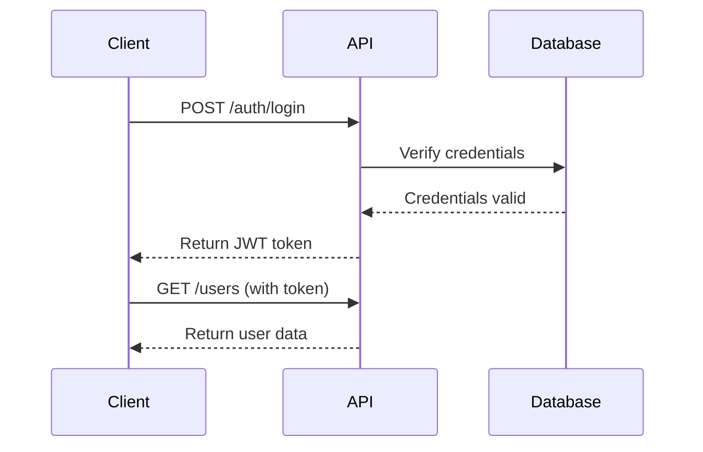

# Technical Documentation

## Purpose
Create clear, comprehensive technical documentation that helps developers, users, and stakeholders understand and use your product, API, or system effectively.

## When to Use
- Documenting APIs, SDKs, or libraries
- Creating user guides for software products
- Writing integration guides
- Documenting system architecture
- Creating developer onboarding materials

## Types of Technical Documentation

### 1. API Documentation
**Purpose**: Help developers integrate with your API

**Key Components**:
- Authentication methods
- Endpoints (methods, parameters, responses)
- Error codes and messages
- Rate limits
- Code examples in multiple languages
- Changelog

### 2. SDK Documentation
**Purpose**: Guide developers using your SDK/library

**Key Components**:
- Installation instructions
- Quick start guide
- Class/method reference
- Usage examples
- Best practices
- Troubleshooting

### 3. User Guides
**Purpose**: Help end-users accomplish tasks

**Key Components**:
- Getting started guide
- Feature walkthroughs
- Common use cases
- FAQ
- Troubleshooting
- Tips and tricks

### 4. Integration Guides
**Purpose**: Guide users through connecting your product with others

**Key Components**:
- Prerequisites
- Step-by-step integration process
- Configuration options
- Testing instructions
- Common issues

### 5. Architecture Documentation
**Purpose**: Explain system design and structure

**Key Components**:
- System overview
- Component descriptions
- Data flow diagrams
- Tech stack details
- Design decisions and rationale

## API Documentation Structure

### Overview Section

```markdown
# [API Name] API Documentation

## Overview

[Brief description of what the API does]

**Base URL**: `https://api.example.com/v1`
**Protocol**: REST
**Data Format**: JSON
**Rate Limit**: 1000 requests/hour

## Quick Start

```bash
curl -X GET "https://api.example.com/v1/users" \
  -H "Authorization: Bearer YOUR_API_KEY"
```

[Expected response]
```

### Authentication

```markdown
## Authentication

All API requests require authentication using an API key.

### Getting Your API Key

1. Log in to your account
2. Navigate to Settings > API Keys
3. Click "Generate New Key"

### Using Your API Key

Include your API key in the `Authorization` header:

```bash
Authorization: Bearer YOUR_API_KEY
```

**Example**:
```bash
curl -X GET "https://api.example.com/v1/resource" \
  -H "Authorization: Bearer sk_test_1234567890"
```

### Security Best Practices

- Never expose API keys in client-side code
- Rotate keys regularly
- Use environment variables to store keys
- Use different keys for development and production
```

### Endpoint Documentation

**Template for each endpoint**:

```markdown
## [Endpoint Name]

`[HTTP METHOD] /path/to/endpoint`

[Brief description of what this endpoint does]

### Parameters

| Parameter | Type | Required | Description |
|-----------|------|----------|-------------|
| `param1` | string | Yes | Description of param1 |
| `param2` | integer | No | Description of param2 |
| `param3` | boolean | No | Description of param3. Default: `false` |

### Request Example

```bash
curl -X POST "https://api.example.com/v1/users" \
  -H "Authorization: Bearer YOUR_API_KEY" \
  -H "Content-Type: application/json" \
  -d '{
    "name": "John Doe",
    "email": "john@example.com"
  }'
```

### Response Example

**Success (200)**:
```json
{
  "id": "user_123",
  "name": "John Doe",
  "email": "john@example.com",
  "created_at": "2025-01-01T00:00:00Z"
}
```

**Error (400)**:
```json
{
  "error": {
    "code": "invalid_email",
    "message": "The email address is invalid"
  }
}
```

### Response Fields

| Field | Type | Description |
|-------|------|-------------|
| `id` | string | Unique identifier for the user |
| `name` | string | User's full name |
| `email` | string | User's email address |
| `created_at` | string | ISO 8601 timestamp of creation |

### Error Codes

| Code | Description | Solution |
|------|-------------|----------|
| `invalid_email` | Email format is invalid | Provide a valid email address |
| `duplicate_email` | Email already exists | Use a different email or retrieve existing user |
```

### Error Handling

```markdown
## Error Handling

The API uses standard HTTP status codes:

| Status Code | Meaning |
|-------------|---------|
| 200 | Success |
| 201 | Created |
| 400 | Bad Request - Invalid parameters |
| 401 | Unauthorized - Invalid API key |
| 404 | Not Found - Resource doesn't exist |
| 429 | Too Many Requests - Rate limit exceeded |
| 500 | Internal Server Error |

### Error Response Format

All errors return a JSON object:

```json
{
  "error": {
    "code": "error_code",
    "message": "Human-readable error message",
    "details": {
      "field": "Additional context"
    }
  }
}
```

### Handling Errors

```javascript
try {
  const response = await fetch('https://api.example.com/v1/users', {
    headers: { 'Authorization': 'Bearer YOUR_API_KEY' }
  });

  if (!response.ok) {
    const error = await response.json();
    console.error('API Error:', error.error.message);
    // Handle specific error codes
    if (error.error.code === 'rate_limit_exceeded') {
      // Wait and retry
    }
  }
} catch (err) {
  console.error('Network error:', err);
}
```
```

## SDK Documentation Structure

### Installation

```markdown
## Installation

### npm
```bash
npm install @company/sdk
```

### yarn
```bash
yarn add @company/sdk
```

### pnpm
```bash
pnpm add @company/sdk
```

### Requirements

- Node.js 16+ or
- Python 3.8+
- API Key (get one from [dashboard](https://app.example.com))
```

### Quick Start

```markdown
## Quick Start

### 1. Initialize the Client

```javascript
import { Client } from '@company/sdk';

const client = new Client({
  apiKey: 'YOUR_API_KEY'
});
```

### 2. Make Your First Request

```javascript
const user = await client.users.create({
  name: 'John Doe',
  email: 'john@example.com'
});

console.log('User created:', user.id);
```

### 3. Handle Errors

```javascript
try {
  const user = await client.users.get('user_123');
} catch (error) {
  if (error.code === 'not_found') {
    console.log('User not found');
  } else {
    console.error('Error:', error.message);
  }
}
```
```

### Method Reference

```markdown
## API Reference

### Client

#### `new Client(options)`

Create a new SDK client instance.

**Parameters**:
- `options` (object)
  - `apiKey` (string, required): Your API key
  - `baseURL` (string, optional): API base URL. Default: `https://api.example.com`
  - `timeout` (number, optional): Request timeout in ms. Default: `30000`

**Example**:
```javascript
const client = new Client({
  apiKey: process.env.API_KEY,
  timeout: 10000
});
```

### Users

#### `client.users.create(data)`

Create a new user.

**Parameters**:
- `data` (object)
  - `name` (string, required): User's full name
  - `email` (string, required): User's email address
  - `metadata` (object, optional): Additional user data

**Returns**: Promise<User>

**Example**:
```javascript
const user = await client.users.create({
  name: 'John Doe',
  email: 'john@example.com',
  metadata: { plan: 'pro' }
});
```

**Response**:
```javascript
{
  id: 'user_123',
  name: 'John Doe',
  email: 'john@example.com',
  metadata: { plan: 'pro' },
  created_at: '2025-01-01T00:00:00Z'
}
```

#### `client.users.get(id)`

Retrieve a user by ID.

**Parameters**:
- `id` (string, required): User ID

**Returns**: Promise<User>

**Throws**:
- `NotFoundError`: User doesn't exist
- `AuthenticationError`: Invalid API key

**Example**:
```javascript
try {
  const user = await client.users.get('user_123');
  console.log(user.name);
} catch (error) {
  if (error.code === 'not_found') {
    console.log('User not found');
  }
}
```
```

## User Guide Structure

### Getting Started

```markdown
# Getting Started with [Product Name]

## Welcome!

[Brief introduction to the product and what it helps users accomplish]

## Prerequisites

Before you begin, make sure you have:
- [Requirement 1]
- [Requirement 2]
- [Requirement 3]

## Installation

[Step-by-step installation instructions]

## Your First [Task]

Follow these steps to [accomplish something meaningful]:

### Step 1: [Action]
[Instructions with screenshot]

### Step 2: [Action]
[Instructions with screenshot]

### Step 3: [Action]
[Instructions with screenshot]

## What's Next?

Now that you've completed your first [task], you can:
- [Next thing to try]
- [Another feature to explore]
- [Link to advanced guide]
```

### Feature Documentation

```markdown
## [Feature Name]

[Brief description of what this feature does and why it's useful]

### How It Works

[Explain the concept or mechanism]

### Using [Feature Name]

#### Basic Usage

1. [Step 1]
2. [Step 2]
3. [Step 3]

**Example**:
[Screenshot or code example]

#### Advanced Options

**[Option 1]**: [Description and use case]
**[Option 2]**: [Description and use case]

### Common Use Cases

#### Use Case 1: [Scenario]
[How to accomplish this specific task]

#### Use Case 2: [Scenario]
[How to accomplish this specific task]

### Tips and Best Practices

- ✅ **Do**: [Best practice 1]
- ✅ **Do**: [Best practice 2]
- ❌ **Don't**: [Anti-pattern 1]
- ❌ **Don't**: [Anti-pattern 2]

### Troubleshooting

**Problem**: [Common issue]
**Solution**: [How to fix it]

**Problem**: [Another common issue]
**Solution**: [How to fix it]
```

## Writing Style Guidelines

### Clarity First

**✅ Good**:
```markdown
The `timeout` parameter sets the maximum time (in milliseconds) to wait for a response.
```

**❌ Bad**:
```markdown
The timeout parameter controls temporal constraints on response acquisition.
```

### Use Active Voice

**✅ Good**: "The API returns a JSON object"
**❌ Bad**: "A JSON object is returned by the API"

### Be Concise

**✅ Good**: "Send a POST request to `/users` to create a user"
**❌ Bad**: "In order to create a new user in the system, you will need to send a POST request to the `/users` endpoint"

### Use Examples Liberally

Every concept should have:
- A code example
- Expected output
- Common variations

### Consistent Terminology

Create a terminology guide:
```markdown
## Terminology

- **API Key**: Use "API key" (not "api key", "API-key", or "token")
- **Endpoint**: Use "endpoint" (not "route" or "path")
- **Parameter**: Use "parameter" (not "param" or "argument" for API docs)
```

## Code Examples Best Practices

### Multiple Languages

Provide examples in commonly used languages:

```markdown
## Code Examples

### JavaScript
```javascript
const response = await client.users.create({
  name: 'John Doe'
});
```

### Python
```python
response = client.users.create(
    name='John Doe'
)
```

### cURL
```bash
curl -X POST "https://api.example.com/v1/users" \
  -H "Authorization: Bearer YOUR_API_KEY" \
  -d '{"name": "John Doe"}'
```
```

### Complete, Runnable Examples

**✅ Good - Complete example**:
```javascript
import { Client } from '@company/sdk';

const client = new Client({
  apiKey: process.env.API_KEY
});

async function createUser() {
  try {
    const user = await client.users.create({
      name: 'John Doe',
      email: 'john@example.com'
    });
    console.log('Created user:', user.id);
  } catch (error) {
    console.error('Error:', error.message);
  }
}

createUser();
```

**❌ Bad - Incomplete**:
```javascript
client.users.create({name: 'John'});
```

### Commented Examples

```javascript
// Initialize the client with your API key
const client = new Client({
  apiKey: 'your_api_key_here'
});

// Create a new user
const user = await client.users.create({
  name: 'John Doe',
  email: 'john@example.com',
  // Optional: Add custom metadata
  metadata: {
    source: 'website',
    referral: 'google'
  }
});

// The response includes the user ID and creation timestamp
console.log(`User ${user.id} created at ${user.created_at}`);
```

## Visual Elements

### Diagrams

**When to use**:
- System architecture
- Data flow
- Process workflows
- Authentication flows

**Tools**:
- Mermaid (for text-based diagrams in Markdown)
- Lucidchart, Draw.io (for complex diagrams)

**Example (Mermaid)**:
```markdown

```

### Screenshots

**Best practices**:
- High resolution (2x retina)
- Annotate with arrows/highlights
- Keep UI chrome to minimum
- Update when UI changes

### Tables

Use tables for:
- Parameter lists
- Error codes
- Comparison of options
- Quick reference data

## Versioning and Changelogs

### Version Documentation

```markdown
# API Version 2.0

## What's New in v2.0

### Breaking Changes
- **Authentication**: Now requires Bearer token instead of API key in query string
- **Endpoints**: All endpoints now use `/v2/` prefix
- **Response Format**: Pagination now uses `cursor` instead of `offset`

### Migration Guide

#### 1. Update Authentication

**Before (v1)**:
```javascript
fetch('https://api.example.com/users?api_key=XXX')
```

**After (v2)**:
```javascript
fetch('https://api.example.com/v2/users', {
  headers: { 'Authorization': 'Bearer XXX' }
})
```

#### 2. Update Pagination

[...more migration steps]

### New Features
- Webhooks support
- Bulk operations
- Advanced filtering

### Deprecated
- `/v1/users/search` - Use `/v2/users?query=` instead
```

### Changelog

```markdown
## Changelog

### v2.1.0 - 2025-01-15

**Added**:
- New `users.search()` method with full-text search
- Support for webhook signatures

**Changed**:
- Improved error messages for validation failures
- Rate limit increased to 2000 requests/hour for pro plans

**Fixed**:
- Fixed pagination bug in `users.list()`
- Corrected timezone handling in date fields

**Deprecated**:
- `users.find()` - Use `users.search()` instead (will be removed in v3.0)

### v2.0.0 - 2024-12-01
[...previous versions]
```

## Maintenance

### Keep Documentation Up to Date

**Update documentation when**:
- Adding new features
- Changing API behavior
- Fixing bugs that affect usage
- Deprecating features
- Receiving user feedback

### Documentation Review Process

1. **Before releasing**: Review docs for completeness
2. **During beta**: Get feedback from beta users
3. **After release**: Monitor support tickets for confusion
4. **Quarterly**: Comprehensive review and update

### Common Outdated Patterns

- Screenshots of old UI
- Deprecated methods still shown as primary
- Missing new features
- Broken links
- Old version numbers

## Quality Checklist

**Before Publishing**:

**Completeness**:
- [ ] All public methods/endpoints documented
- [ ] Parameters and return values described
- [ ] Error codes and messages listed
- [ ] Examples provided for common use cases

**Accuracy**:
- [ ] Code examples tested and work
- [ ] Parameter types are correct
- [ ] Response examples match actual API
- [ ] Error codes are accurate

**Clarity**:
- [ ] No jargon without explanation
- [ ] Examples are complete and runnable
- [ ] Screenshots are clear and annotated
- [ ] Consistent terminology throughout

**Usability**:
- [ ] Table of contents for navigation
- [ ] Search functionality available
- [ ] Mobile-friendly formatting
- [ ] Copy buttons on code blocks
- [ ] Links to related sections

**Accessibility**:
- [ ] Alt text on images
- [ ] Proper heading hierarchy
- [ ] Color contrast meets standards
- [ ] Keyboard navigation works

---

**Related Skills**:
- Use `tutorial-content` for step-by-step tutorials
- Use `long-form-content` for comprehensive guides
- Use `faq-content` for FAQ sections
- Use `editorial-guidelines` for documentation standards
