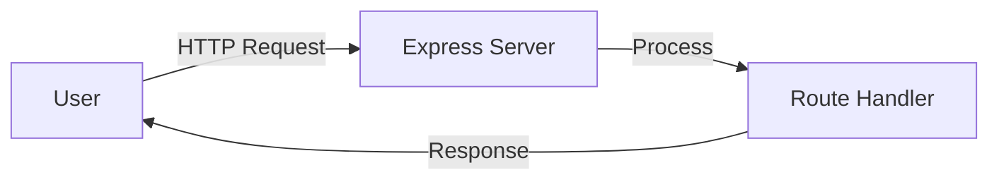

# Tutorial Content

## Purpose
Create clear, actionable step-by-step tutorials that guide users from start to finish in accomplishing a specific task or learning a specific skill.

## When to Use
- Teaching users how to complete a specific task
- Onboarding new users to your product
- Explaining complex processes in simple steps
- Creating educational content for your audience
- Building product feature walkthroughs

## Tutorial vs Other Content Types

| Type | Purpose | Structure | Outcome |
|------|---------|-----------|---------|
| **Tutorial** | Teach by doing | Step-by-step process | Reader accomplishes task |
| **Guide** | Comprehensive coverage | Topic-organized | Reader understands concept |
| **Documentation** | Reference material | Organized by feature | Reader finds information |
| **Blog Post** | Inform/educate | Flexible narrative | Reader gains knowledge |

## Tutorial Structure

### 1. Title

**Format**: `How to [Accomplish Specific Result]`

**✅ Good titles**:
- "How to Build a REST API with Node.js and Express"
- "How to Deploy a React App to Vercel in 5 Minutes"
- "How to Set Up Automated Testing with Jest"

**❌ Bad titles**:
- "Node.js Tutorial" (too vague)
- "Everything About APIs" (too broad)
- "Working with Express" (no clear outcome)

### 2. Introduction (100-200 words)

**Components**:
```markdown
## Introduction

[What the reader will build/accomplish]
  ↓
[Why this is valuable/useful]
  ↓
[What they'll learn along the way]
  ↓
[Time estimate and difficulty level]
  ↓
[Prerequisites (what they need to know/have)]
```

**Example**:
> In this tutorial, you'll build a fully functional REST API for a todo application using Node.js and Express. By the end, you'll have a working API with create, read, update, and delete (CRUD) operations.
>
> This API structure forms the foundation for most web applications, and the patterns you'll learn apply to projects of any size. You'll also learn how to structure your code, handle errors, and test your endpoints.
>
> **Time**: 30 minutes | **Difficulty**: Beginner | **Prerequisites**: Basic JavaScript knowledge, Node.js installed

### 3. Prerequisites Section

**Be specific and actionable**:

```markdown
## Prerequisites

Before starting, make sure you have:

### Required
- **Node.js 16+** installed ([download here](https://nodejs.org))
  - Verify: Run `node --version` in your terminal
- **npm or yarn** (comes with Node.js)
- **A code editor** (we recommend [VS Code](https://code.visualstudio.com))

### Recommended
- Basic understanding of JavaScript ES6 syntax
- Familiarity with the command line
- Postman or similar tool for testing APIs ([download Postman](https://postman.com))

### What You Don't Need
- You don't need prior experience with Express
- You don't need to know about databases (we'll use in-memory storage)
```

### 4. What You'll Build (Optional but Recommended)

**Show the end result first**:

```markdown
## What You'll Build

By the end of this tutorial, you'll have:

- A working REST API with 5 endpoints
- Full CRUD functionality for todos
- Error handling and validation
- Code organized following best practices

**Final API endpoints**:
```
GET    /api/todos       - Get all todos
GET    /api/todos/:id   - Get one todo
POST   /api/todos       - Create a todo
PUT    /api/todos/:id   - Update a todo
DELETE /api/todos/:id   - Delete a todo
```

**Demo**: Try the [finished API](https://example.com/demo) or view the [complete code](https://github.com/...)
```

### 5. Step-by-Step Instructions

**Each step should**:
- Have a clear, action-oriented heading
- Explain what and why before how
- Provide complete code (not snippets)
- Show expected output
- Highlight common mistakes

**Template for each step**:

```markdown
## Step [N]: [Clear Action Description]

[Brief explanation of what this step does and why it's needed]

### [Sub-task if needed]

[Instruction]

**Code**:
```language
[Complete, runnable code]
```

**Expected output**:
```
[What they should see]
```

**✅ Checkpoint**: [How to verify this step worked]

**⚠️ Troubleshooting**:
- **Problem**: [Common issue]
  **Solution**: [How to fix]
```

**Example**:

```markdown
## Step 1: Initialize Your Project

We'll start by creating a new Node.js project and installing Express. This sets up the foundation for our API.

### Create project directory

Open your terminal and run:

```bash
mkdir todo-api
cd todo-api
npm init -y
```

This creates a new folder and initializes it with a `package.json` file.

### Install Express

```bash
npm install express
```

**Expected output**:
```
added 57 packages in 3s
```

**✅ Checkpoint**: You should now have a `node_modules` folder and see `express` listed in your `package.json` under `dependencies`.

**⚠️ Troubleshooting**:
- **Problem**: `npm: command not found`
  **Solution**: Node.js isn't installed. Download it from [nodejs.org](https://nodejs.org)
- **Problem**: Permission errors on Mac/Linux
  **Solution**: Don't use `sudo`. Instead, [fix npm permissions](https://docs.npmjs.com/resolving-eacces-permissions-errors)
```

### 6. Testing/Verification Section

```markdown
## Testing Your API

Let's verify everything works by testing each endpoint.

### Using Postman

1. Open Postman
2. Create a new request
3. Set method to `GET`
4. Enter URL: `http://localhost:3000/api/todos`
5. Click "Send"

**Expected response**:
```json
{
  "todos": []
}
```

### Using cURL

```bash
curl http://localhost:3000/api/todos
```

### Using VS Code REST Client

[Alternative method]
```

### 7. Next Steps

```markdown
## Next Steps

Congratulations! You've built a working REST API. Here's what you can do next:

### Immediate Improvements
- [ ] Add input validation using a library like Joi
- [ ] Implement persistent storage with a database
- [ ] Add user authentication

### Learn More
- **Tutorial**: [How to Add MongoDB to Your API](link)
- **Tutorial**: [How to Deploy Your API to Heroku](link)
- **Guide**: [REST API Best Practices](link)

### Challenge
Try extending the API:
- Add a "completed" field to todos
- Implement filtering (e.g., `/api/todos?completed=true`)
- Add pagination for large datasets
```

### 8. Complete Code

```markdown
## Complete Code

Here's the full code for reference:

**File: `server.js`**
```javascript
[Complete, final code]
```

**File: `package.json`**
```json
[Complete package.json]
```

**GitHub**: View the [complete project on GitHub](link)
```

## Writing Style

### Use Second Person ("You")

**✅ Good**: "You'll create a new file called `server.js`"
**❌ Bad**: "We'll create..." or "One should create..."

### Active, Direct Language

**✅ Good**: "Run `npm install express`"
**❌ Bad**: "The next thing you'll want to do is run the npm install command for express"

### Explain Why, Not Just How

**✅ Good**:
> Install Express, a minimal web framework that makes building APIs easier by handling routing and middleware for you.

**❌ Bad**:
> Install Express.

### Break Down Complex Steps

**✅ Good**:
```markdown
## Step 3: Create the Server

### Create server.js
Create a new file called `server.js` in your project root.

### Add the basic server code
Add the following code...

### Start the server
Run `node server.js`...
```

**❌ Bad**:
```markdown
## Step 3: Create server.js and add code and run it
[Everything mixed together]
```

## Code Best Practices

### Show Complete Files

**✅ Good**:
```javascript
// server.js
const express = require('express');
const app = express();

app.use(express.json());

app.get('/api/todos', (req, res) => {
  res.json({ todos: [] });
});

app.listen(3000, () => {
  console.log('Server running on port 3000');
});
```

**❌ Bad (incomplete snippet)**:
```javascript
app.get('/api/todos', (req, res) => {
  res.json({ todos: [] });
});
```

### Add Comments for Clarity

```javascript
// Import Express framework
const express = require('express');

// Create Express app instance
const app = express();

// Middleware to parse JSON request bodies
app.use(express.json());

// In-memory storage for todos (will be lost when server restarts)
let todos = [];
```

### Highlight New/Changed Code

Use comments or explanations:

```markdown
Add this code to `server.js` (below the existing imports):

```javascript
// NEW: Import the database module
const db = require('./database');

// NEW: Initialize database connection
db.connect();
```

Or use diff formatting:

```diff
const express = require('express');
+ const db = require('./database');

const app = express();
+ db.connect();
```

### Show Expected Output

```markdown
Run the server:

```bash
node server.js
```

**You should see**:
```
Server running on port 3000
Database connected
```

**If you see an error**, check that...
```

## Visual Aids

### Screenshots

**When to include screenshots**:
- UI interactions
- Configuration screens
- Expected visual results
- Tool setup

**Best practices**:
- Annotate with arrows and highlights
- Keep resolution high but file size reasonable
- Update when UI changes
- Use consistent styling (same browser, theme)

### Diagrams

**When to use diagrams**:
- Explaining architecture
- Showing data flow
- Illustrating relationships

**Example**:
```markdown
## How It Works


```

### Code Structure Diagrams

```markdown
## Project Structure

```
todo-api/
├── server.js          # Main server file
├── routes/
│   └── todos.js       # Todo routes
├── models/
│   └── todo.js        # Todo data model
├── package.json
└── node_modules/
```
```

## Common Tutorial Patterns

### The "Build Along" Tutorial

**Structure**:
1. Show end result
2. Start from scratch
3. Build incrementally
4. Test at each stage
5. Add improvements
6. Recap what was built

**Best for**: Learning by doing, product tutorials

### The "Problem-Solution" Tutorial

**Structure**:
1. Present a common problem
2. Explain why it's challenging
3. Introduce the solution
4. Implement step-by-step
5. Show results
6. Discuss alternatives

**Best for**: Solving specific pain points

### The "Concept-Practice" Tutorial

**Structure**:
1. Explain the concept
2. Show simple example
3. Build on the example
4. Add complexity gradually
5. Practice exercises
6. Advanced applications

**Best for**: Teaching new concepts or techniques

## Difficulty Levels

### Beginner Tutorials

**Characteristics**:
- Assume minimal prior knowledge
- Explain every step in detail
- Define technical terms
- Provide more context and "why"
- Include troubleshooting for common issues
- Time: 15-45 minutes

**Example prerequisite**:
> Prerequisites: Basic understanding of HTML. No JavaScript knowledge required—we'll explain everything as we go.

### Intermediate Tutorials

**Characteristics**:
- Assume foundational knowledge
- Can move faster through basics
- Focus on best practices
- Introduce more complex patterns
- Time: 30-90 minutes

**Example prerequisite**:
> Prerequisites: Comfortable with JavaScript ES6 syntax and have built at least one Node.js application.

### Advanced Tutorials

**Characteristics**:
- Assume strong foundation
- Focus on optimization and edge cases
- Discuss trade-offs
- Less hand-holding
- Time: 1-3 hours

**Example prerequisite**:
> Prerequisites: Experience with React Hooks, state management, and asynchronous JavaScript.

## Quality Checklist

**Before Publishing**:

**Structure**:
- [ ] Clear, specific title with outcome
- [ ] Introduction explains what and why
- [ ] Prerequisites listed explicitly
- [ ] Steps are numbered and sequential
- [ ] Each step has verification/checkpoint
- [ ] Next steps provided

**Code**:
- [ ] All code examples tested and work
- [ ] Complete files shown (not just snippets)
- [ ] Code is commented where helpful
- [ ] Expected output shown
- [ ] Error handling included

**Clarity**:
- [ ] Every step explains "why" not just "how"
- [ ] Technical terms defined on first use
- [ ] Screenshots added where helpful
- [ ] Consistent formatting throughout

**Usability**:
- [ ] Copy buttons on code blocks
- [ ] Links to prerequisites/tools
- [ ] Troubleshooting for common issues
- [ ] Estimated time provided
- [ ] Difficulty level stated

**Completeness**:
- [ ] Reader can complete without external research
- [ ] All commands and code provided
- [ ] Final working code available
- [ ] Follow-up resources linked

## Common Mistakes

### 1. Skipping the "Why"
❌ **Don't**: "Now run this command:"
✅ **Do**: "Now run this command to install dependencies your project needs:"

### 2. Assuming Too Much Knowledge
❌ **Don't**: "Create a React component with hooks"
✅ **Do**: "Create a React component. We'll use hooks (a React feature for managing state) to..."

### 3. Incomplete Code Examples
❌ **Don't**: Show snippets that won't run standalone
✅ **Do**: Show complete, runnable files

### 4. No Verification Steps
❌ **Don't**: Move to next step without confirming current step works
✅ **Do**: Include checkpoints: "You should now see..."

### 5. Outdated Information
❌ **Don't**: Let tutorials get stale with old versions
✅ **Do**: Update regularly or add version notes

### 6. No Troubleshooting
❌ **Don't**: Assume everything will work perfectly
✅ **Do**: Address common errors and how to fix them

## Templates

### Basic Tutorial Template

```markdown
# How to [Accomplish Task]

## Introduction
[What they'll build and why it matters]

## Prerequisites
- Required item 1
- Required item 2

## What You'll Build
[Description and final result]

## Step 1: [Action]
[Instructions]

## Step 2: [Action]
[Instructions]

## Step 3: [Action]
[Instructions]

## Testing
[How to verify it works]

## Next Steps
[What to do next]

## Complete Code
[Full code for reference]
```

---

**Related Skills**:
- Use `technical-documentation` for reference documentation
- Use `blog-post-writing` for concept explanation posts
- Use `video-scripts` to turn tutorials into video content
